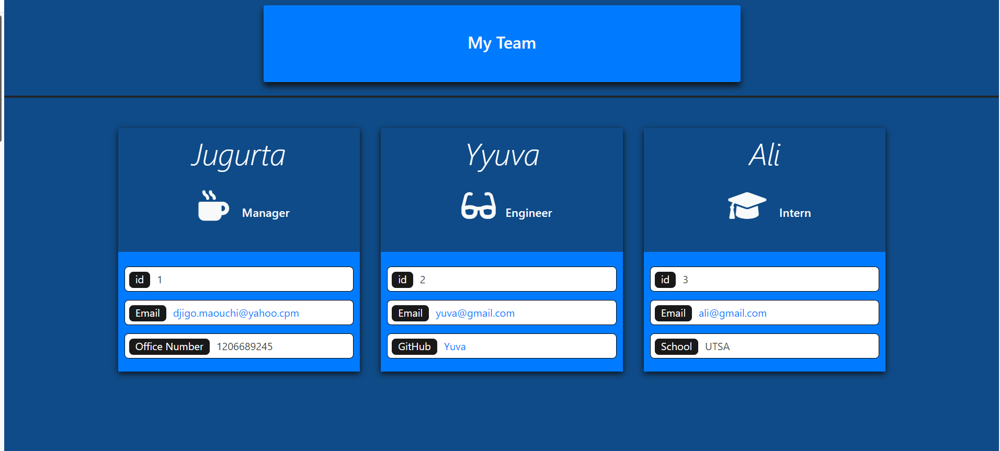

  # license used:  ISC  

  # Title: Portfolio Generator 

  # Table of  Contents

  * [Title](#title)
  * [About](#about)
  * [Built](#languages)
  * [Instalation](#header.instal)
  * [Usage](header.usage)
  * [Link](#Link)
  * [Contribution](#header.contribution)

  # About The Application:
    This app will allow any manager to build his team, with answering a prompt question
    

  # Built With:
    HTML, CSS, JavaScript, Bootstrap, Node.js
    

  # Instalation:
    To instal this app you need to clone the repo, then open it inside your vsCode, then run node.index to answer the questions 

  
  
  # Click here to see a walckthrough:   

  Part 1: TDD part  https://github.com/Jmaouchi/Team-Profile-Generator/issues/3

  Part 2: Run app   https://github.com/Jmaouchi/Team-Profile-Generator/issues/2

  

    
  # Usage:
    Create a work team
  

  ## Link:  
  https://github.com/Jmaouchi/Team-Profile-Generator
  

  # Contact:
  djigo.maouchi@yahoo.com

  # Contribution:
    Built by Jugurta Maouchi   ©️2022 Portfolio_Generator, Inc
